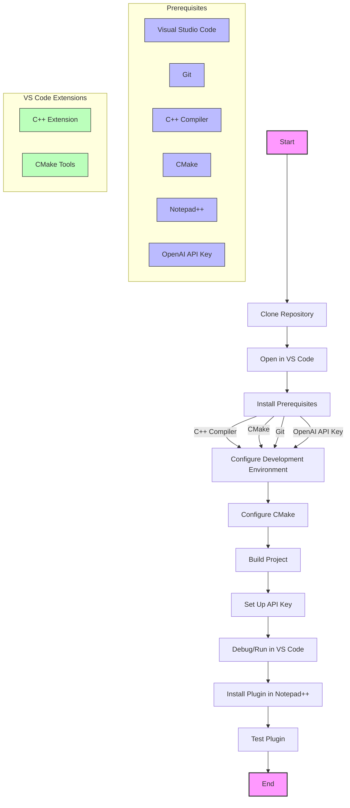

To build and run the `nppopenai` project using Visual Studio Code (VS Code), follow this walkthrough. The project `nppopenai` is a plugin for Notepad++ that integrates with OpenAI, and it is implemented using C++.

### Prerequisites

1. **Visual Studio Code**: Make sure you have VS Code installed on your machine. You can download it from the [official website](https://code.visualstudio.com/).
2. **Git**: Ensure Git is installed for cloning the repository. Download it from [here](https://git-scm.com/downloads).
3. **C++ Compiler**: Install a C++ compiler. You can use the one provided by Visual Studio or GCC on Windows via MinGW.
4. **CMake**: CMake is required to build the project. Download it from [here](https://cmake.org/download/).
5. **Notepad++**: Install Notepad++ since it's the target application for the plugin.
6. **OpenAI API Key**: You will need an API key from OpenAI. You can get one by signing up on the [OpenAI website](https://openai.com/).

### Step-by-Step Walkthrough

#### 1. Clone the Repository

Open a terminal in VS Code or your system's terminal and run:

```bash
git clone https://github.com/Krazal/nppopenai.git
```

Navigate into the cloned directory:

```bash
cd nppopenai
```

#### 2. Open the Project in VS Code

- Launch VS Code.
- Use the `File` > `Open Folder...` menu and select the `nppopenai` folder you just cloned.

#### 3. Configure the Development Environment

- **Install the C++ extension**: In VS Code, go to the Extensions view by clicking the square icon on the sidebar or pressing `Ctrl+Shift+X`. Search for "C++" and install the extension provided by Microsoft.

- **Install CMake Tools**: Similarly, search for "CMake Tools" in the Extensions view and install it. This will help manage the CMake configurations and build processes.

#### 4. Configure CMake

- In the VS Code Command Palette (`Ctrl+Shift+P`), type and select `CMake: Configure`.
- Select a CMake kit (this is your C++ compiler). If you have Visual Studio installed, you might see options like "Visual Studio 16 2019". Choose the appropriate one.
- If prompted, configure the generator for this project. For a Visual Studio compiler, you might use "Ninja" or "Visual Studio 16 2019".

#### 5. Build the Project

- Again, in the Command Palette (`Ctrl+Shift+P`), type `CMake: Build` and select it. This will start the build process using CMake.
- Any errors or issues will appear in the terminal and Problems view. Make sure all dependencies are installed and configured correctly.

#### 6. Set Up API Key

- You will need to configure the API key for OpenAI. Typically, this would be done by modifying a configuration file or setting an environment variable.
- Look for a configuration file or a section in the code where the API key is defined. You might need to add your key there.

#### 7. Debugging and Running

- To debug, open the `launch.json` configuration file in the `.vscode` folder and set up the debug configuration.
- Click the Run view icon on the sidebar or press `Ctrl+Shift+D`. From here, you can start debugging by pressing the green play button.

#### 8. Install the Plugin in Notepad++

- Once built, the resulting DLL or executable should be placed in the Notepad++ plugins folder.
- The exact path may vary, but it's typically found in `C:\Program Files\Notepad++\plugins\` or `%AppData%\Notepad++\plugins\`.
- Copy the compiled plugin (DLL file) into the appropriate plugins folder.

#### 9. Test the Plugin

- Launch Notepad++ and look for the plugin under the Plugins menu.
- Test the functionality to ensure it works as expected.

### Additional Tips

- **Error Handling**: If you encounter errors during build, check the terminal and Problems view in VS Code. CMake errors often provide hints about what is missing.
- **Documentation**: Refer to the `nppopenai` repository documentation for any specific build instructions or dependencies.
- **Updates**: Keep VS Code, extensions, and dependencies updated to the latest versions for compatibility.

This walkthrough should help you get started with building and running the `nppopenai` project using Visual Studio Code. If you encounter any issues or need further assistance, feel free to ask!

